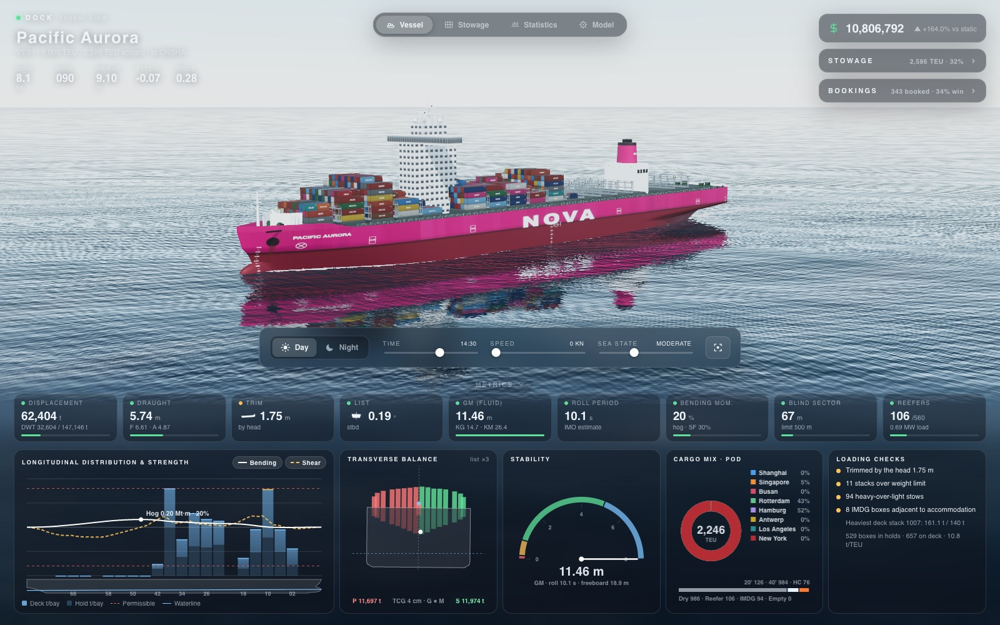
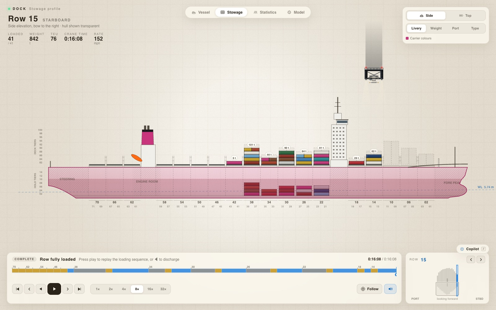
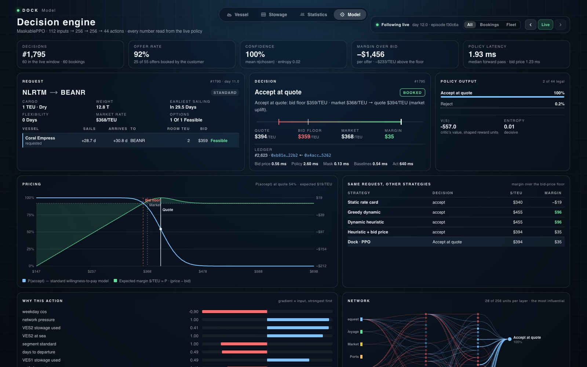
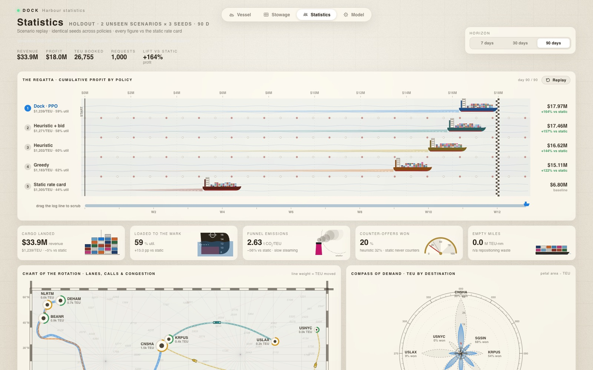
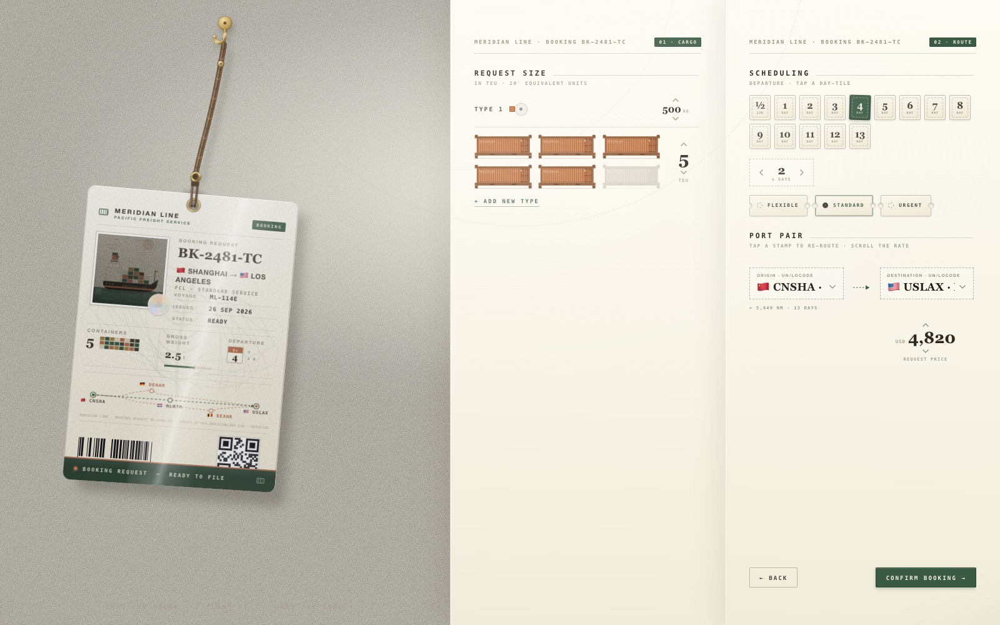
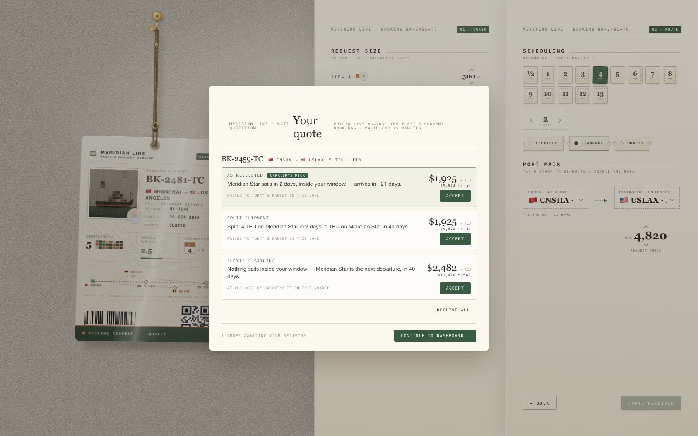
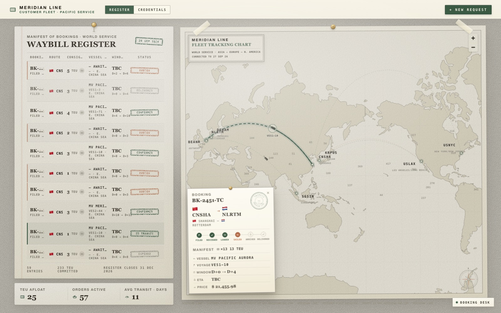

<div align="center">

# Dock

**Dynamic revenue management for container-shipping fleets — running live, end to end.**

A digital twin of a container line · a trained MaskablePPO policy making every booking
decision · structured counter-offers instead of rejections · hash-chained audit ledger ·
on-chain settlement on a real EVM · two full frontends · two LLM assistants.




`plan.md` — product source of truth · `abstract.md` — full technical deep-dive · `api.md` — API reference

</div>

---

## Why this exists

Container shipping moves ~80% of global trade (~$141B in 2025) — yet it still prices
its most perishable asset, a container slot on a specific voyage on a specific date,
with a **flat weekly rate card and binary accept/reject**. Airlines solved this in
the 1980s and unlocked 3–9% more revenue. Shipping never did.

Dock replaces the rate card with an integrated decision system that knows what
capacity is worth across the whole network, what's physically possible to load,
how to negotiate instead of reject, and when to hold capacity for a better booking
tomorrow — and it is actually running.

## Screens

The two live frontends, on real data — nothing mocked:

| | |
|---|---|
|  |  |
| **Vessel** — live 3D hull per ship, hydrostatics, bookings rail | **Stowage** — the real cargo plan, side elevation + replays |
|  |  |
| **Model** — the PPO decision inspector: every number live | **Statistics** — the five-policy regatta on holdout data |
|  |  |
| **Customer intake** — file a booking in ~30 seconds | **Offer slip** — priced counter-offers, not rejections |
|  | |
| **Customer dashboard** — orders to delivery on the live fleet | |

## The decision stack

```
                BOOKING REQUEST
                      │
        ┌─────────────┴──────────────┐
        │  Demand forecasting        │  closed-form ridge on climatology
        └─────────────┬──────────────┘   residuals, bound per episode
                      ▼
        ┌────────────────────────────┐
        │  Bid-price engine          │  shadow price per leg / time window;
        └─────────────┬──────────────┘  monopoly markup over the bid floor
                      ▼
        ┌────────────────────────────┐
        │  Stowage constraint solver │  → binary action mask (hard rules,
        └─────────────┬──────────────┘    never learned)
                      ▼
        ┌────────────────────────────┐
        │  RL decision engine        │  MaskablePPO · Discrete(44) · obs 112
        └─────────────┬──────────────┘
                      ▼
        ┌────────────────────────────┐
        │  Negotiation layer         │  accept / flex / alt-hub / split /
        └─────────────┬──────────────┘  reject — each with a reason code
                      ▼
           SIMULATOR / DIGITAL TWIN   (Gymnasium env — trains RL, generates
                                      data, powers the demo; >1000× real-time)

   FastAPI + Postgres + py-evm settlement ── nginx ──► two frontends + two LLM assistants
```

**The world:** 8 ports (Shanghai · Singapore · Busan · Rotterdam · Hamburg ·
Antwerp · LA/LB · NY/NJ), 4 vessels on fixed loops (8,000 / 5,500 / 4,000 /
2,500 TEU), 18 market routes, 3 cargo types × 3 customer segments, fuel +
EU-ETS carbon markets, port congestion, storms, canal blockages.

**Design principles**

- **Hard constraints are never learned** — the RL agent only ever sees physically
  valid actions; the mask does the safety, not the network.
- **No oracle leakage** — pricing and the RL observation consume the trained
  `DemandForecaster`, never the simulator's ground truth. Missing artifacts
  raise `RuntimeError`; nothing degrades silently.
- **Supervised models feed the RL policy; they never replace it.**

## Highlights

- **Opportunity-cost pricing** — every quote reflects the shadow price of
  capacity on every leg of every voyage (`pricing/bid_price.py`), with a
  per-leg reason-coded breakdown (`bid_price_floor` / `market_uplift` /
  `competitiveness_guard`).
- **Negotiation, not rejection** — flexible-window discounts, alternate-hub
  routing, split consignments, priced from bid-price differentials.
  **19–27% counter-offer win rate** vs. the 15–20% airline benchmark.
- **A 44-action MaskablePPO policy** — booking decisions + per-vessel speed +
  empty repositioning, trained over a 5-phase curriculum (~1.8M steps,
  `runs/ppo_c1..c5`, holdout scenarios never touched).
- **On-chain settlement** — accepted conditional deals register on
  `DockSettlement.sol` (a real in-process EVM, real tx hashes): depart within
  board-day ±2d, deliver within +45d, 1000 bps carrier-late penalty.
- **Tamper-evident audit** — every event lands in a Keccak-256 hash-chained
  ledger; `scripts/verify_ledger.py` proves it.
- **Live policy introspection** — the Model page runs a real forward+backward
  pass per decision: masked probabilities, value, entropy, activations,
  attributions, pricing curves, counterfactuals.
- **Two LLM assistants** — the customer Booking Desk (can quote and, on
  explicit confirmation, book) and a read-only operator Copilot — same
  bounded tool functions as the REST routes.
- **Honest failure states** — no mock or cached fallbacks; when the API is
  unreachable the UIs say so.

## Results — the ablation ladder

Five policies run the **identical simulator on identical demand**; each rung
adds one capability. Holdout evaluation (`runs/ppo_c5/eval_results.json`,
5 episodes × 90 days, scenarios never trained on):

| Policy | What it represents | depressed-demand | volatile-shocks |
|---|---|---:|---:|
| `static` | Weekly rate card, binary accept/reject — the industry today | −$5.2M | $17.0M |
| `greedy` | Myopic market-rate accept | $6.5M | $22.0M |
| `heuristic` | Dynamic pricing + counter-offers | $9.0M | $23.2M |
| `heuristic_bid` | + bid-price opportunity cost | $8.5M | $24.7M |
| **`ppo`** | **Dock — learned sequential policy on all of it** | $8.3M | **$25.9M — best** |

**Honest read:** most of the lift is the decision stack itself — dynamic
pricing + bid floors turn −$5.2M into ~$8–9M in a depressed market before any
learning. RL earns its keep where sequencing matters: top of every baseline
under volatile shocks (+$1.2M over the best heuristic), and top on holdout
aggregate — **$17.97M mean, +164% vs. the rate card**.

## Quickstart

```bash
docker compose up --build
```

- **http://localhost:8080** — port-operator console
- **http://localhost:8080/customers/** — customer booking site
- **http://localhost:8080/api/** — the API (same-origin, via nginx)

On start the API runs migrations, generates the datasets, and launches an
always-on live PPO episode (90-day horizon, `DOCK_LIVE_SPEED` pace — default
1 sim-day/minute). Everything you see is that live world.

`scripts/e2e.sh` drives a customer booking to an on-chain settlement (use
`DOCK_LIVE_SPEED=0.5`). Optional LLM assistants: set `LLM_BASE_URL` /
`LLM_API_KEY` / `LLM_MODEL` in `.env` for any OpenAI-compatible endpoint —
without a key the sites simply don't show them.

### Backend without Docker

```bash
cd backend && python -m venv .venv && source .venv/bin/activate
pip install -r requirements.txt
python -m data.generate --seed 42 --scale 1.0 --out data/generated
python -m models.train --data data/generated --out models/artifacts
python -m pytest -q                                    # 158 tests
python -m scripts.run_episode --episodes 3 --horizon 60
python -m rl.evaluate --model runs/ppo_c5/model.zip --episodes 5 --horizon 90
```

RL training: `bash scripts/run_curriculum.sh` (or `python -m rl.train --phase N
--init-from runs/ppo_cN/model.zip`) — 14d/1-vessel → 30d/2-vessel → +shaping →
90d/full-fleet → +adversarial scenarios.

## Repository layout

```
backend/                 the core system
  simulator/  env/  constraints/  pricing/   digital twin, Gymnasium env,
                                             stowage solver, bid-price engine
  models/  rl/  baselines/  data/            closed-form supervised models, PPO
                                             curriculum, ablation policies
  settlement/  ledger/                       DockSettlement.sol + py-evm chain,
                                             Keccak-256 hash-chained ledger
  server/                                    FastAPI: episodes, orders/quotes,
                                             live feeds, policy introspection,
                                             LLM chat assistants
  tests/ (158)  runs/ppo_c1..c5  demo/
customers/               customer site — Next.js static export, /customers/
drafts/cargo-ship/       operator console — no-build static JS, /
docs/                    INTEGRATION_PLAN, PERF-LATENCY-HANDOFF, images/
scripts/                 smoke.sh · e2e.sh · check_imports.py
plan.md  abstract.md  api.md  backend.md  frontend.md  technical.md
```

## Data & impact

Models train on synthetic data the simulator generates — 10 demand regimes
(seasonality, trade imbalance, Poisson shocks, elastic segments), 2 scenarios
permanently held out. Real-world anchors (Drewry WCI, SCFI, VLSFO, EU ETS)
calibrate the generators (`backend/data/CALIBRATION.md`). Booking-level
demand data with negotiation outcomes doesn't exist publicly — that's why the
simulator is load-bearing.

| Pillar | Claim |
|---|---|
| Economic | 5–12% more revenue per TEU · 4–8pp higher utilization from the same fleet |
| Environmental | 10–20% fewer empty container-miles · carbon-aware speed is a profit decision, not a mandate |
| Social | Counter-offers give small shippers access binary reject denies · every quote is explainable |

## Status

Backend complete: simulator, stowage constraints, bid-price engine, supervised
models, 5-phase PPO curriculum, holdout eval, live API + ledger + on-chain
settlement, LLM assistants — **158 pytest tests green**. Both frontends run on
the live API only. Verified end-to-end by `scripts/e2e.sh`; history in
`docs/INTEGRATION_PLAN.md`, perf work in `docs/PERF-LATENCY-HANDOFF.md`.
