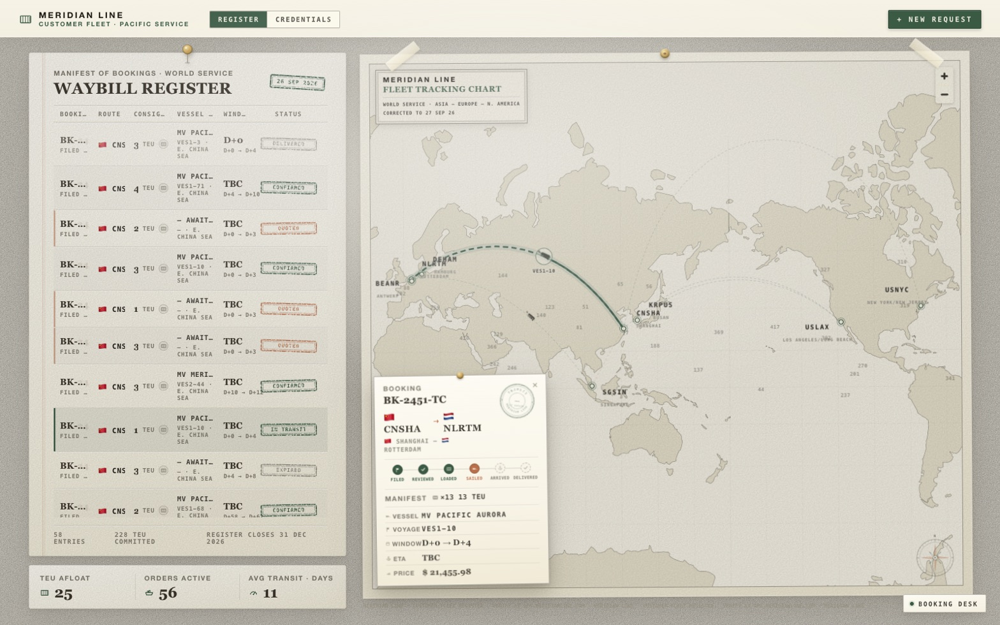

# Dock

**Dynamic revenue management for container shipping fleets — running live.**

Container shipping moves 80% of global trade and generated ~$141B in 2025 — yet it
still prices its most perishable asset (a container slot on a specific voyage on a
specific date) with a flat weekly rate card and binary accept/reject. Airlines
solved this in the 1980s and unlocked 3–9% more revenue. Shipping never did.

Dock replaces the rate card with an integrated decision system that is actually
running: a digital twin of a container line, a trained RL policy making every
booking decision, counter-offers instead of rejections, on-chain settlement for
conditional deals — and two real user-facing sites on top of it, plus an LLM
assistant on each.



> `plan.md` is the product source of truth; `abstract.md` is the full technical
> deep-dive (architecture, training, strategies, results). `api.md` documents the
> API; `frontend.md` maps every screen to its endpoints;
> `docs/PERF-LATENCY-HANDOFF.md` records the live-serving performance work.

## What it does

- **Opportunity-cost pricing** — every quote reflects the shadow price of capacity
  on every leg of every voyage, not a flat route rate.
- **Negotiation, not rejection** — when a booking doesn't fit, Dock issues
  structured counter-offers: flexible-window discounts, alternate-hub routing,
  split consignments. Every response carries a reason code derived from the bid
  price. Measured counter win rate: 19–27% vs. the 15–20% airline benchmark.
- **Stowage-aware decisions** — a deterministic constraint solver (destination-
  order stacking, IMDG hazmat segregation, weight balance, reefer plugs) masks out
  physically impossible actions before pricing or the RL policy ever sees them.
- **Sequential strategy via RL** — a MaskablePPO agent learns the trade-offs a
  static scorer can't represent: holding capacity for premium demand,
  repositioning empties ahead of an export surge, slow-steaming when fuel +
  carbon savings beat delay costs.
- **Resilience** — disruption events (port closures, storms, canal blockages)
  trigger rerouting and repricing in real time.
- **Accountability** — every event lands in a Keccak-256 hash-chained ledger;
  every accepted conditional deal settles on a real in-process EVM contract
  (`DockSettlement.sol`, real tx hashes).
- **Live everything** — no mock data anywhere. Both sites render the running
  simulation; when the API is unreachable they say so.

## Architecture

```
                BOOKING REQUEST
                      │
        ┌─────────────┴──────────────┐
        │  Demand forecasting        │  closed-form ridge on climatology
        └─────────────┬──────────────┘   residuals, bound per episode
                      ▼
        ┌────────────────────────────┐
        │  Bid-price engine          │  shadow price per leg / time window;
        └─────────────┬──────────────┘  monopoly markup over the bid floor
                      ▼
        ┌────────────────────────────┐
        │  Stowage constraint solver │  → binary action mask (hard rules,
        └─────────────┬──────────────┘    never learned)
                      ▼
        ┌────────────────────────────┐
        │  RL decision engine        │  MaskablePPO, Discrete(44),
        └─────────────┬──────────────┘  obs 112
                      ▼
        ┌────────────────────────────┐
        │  Negotiation layer         │  accept / flex / alt-hub / split /
        └─────────────┬──────────────┘  reject — each with a reason code
                      ▼
           SIMULATOR / DIGITAL TWIN   (Gymnasium env — trains RL, generates
                                      data, powers the demo; >1000× real-time)

   FastAPI + Postgres + py-evm settlement ── nginx ──► two frontends + 2 LLM assistants
```

The world: 8 ports (Shanghai · Singapore · Busan · Rotterdam · Hamburg ·
Antwerp · LA/LB · NY/NJ), 4 vessels on fixed loops (8,000 / 5,500 / 4,000 /
2,500 TEU), 18 market routes, 3 cargo types × 3 customer segments, fuel +
EU-ETS carbon markets, port congestion/closures, storms and canal blockages.

Design principles:

- **Hard constraints are never learned.** The RL agent only ever chooses among
  physically valid, legally compliant options.
- **No oracle leakage.** Pricing and the RL observation consume the trained
  `DemandForecaster`, never the simulator's ground-truth demand. Missing model
  artifacts raise `RuntimeError` — nothing degrades silently.
- **Supervised models feed the RL policy; they never replace it.**

## Repository layout

```
backend/                 Python backend (the core system)
  simulator/             Digital twin: ports, fleet, demand, weather, economics
  env/                   Gymnasium wrapper (CargoFleetEnv, Discrete(44), obs 112)
  constraints/           Stowage solver + action masking
  pricing/               Bid-price engine + counter-offer generation
  models/                DemandForecaster (ridge), ElasticityModel, WTPModel,
                         train CLI, committed artifacts
  rl/                    MaskablePPO curriculum training + holdout evaluation
  baselines/             Static / greedy / dynamic heuristic policies
  data/                  Calibration constants, scenario configs, generators
  settlement/            DockSettlement.sol + py-evm chain + deal processor
  ledger/                Hash-chained event ledger (Keccak-256 JSONL)
  server/                FastAPI: episodes, orders/quotes, live feeds,
                         policy introspection, LLM chat assistants
  scripts/               run_episode, export_demo, run_curriculum, verify_ledger
  tests/                 158 pytest tests
  runs/                  Trained checkpoints (ppo_c1..c5) + eval_results.json
  demo/                  Exported 5-policy comparison artifacts (GET /compare/*)
customers/               Customer booking site — Next.js (static export),
                         served at /customers/; booking desk LLM assistant
drafts/cargo-ship/       Port-operator console (no-build static site): live 3D
                         vessels + stowage, bookings feed, statistics, live
                         PPO model inspector, read-only Copilot assistant
docs/                    INTEGRATION_PLAN.md, PERF-LATENCY-HANDOFF.md, images/
scripts/                 smoke.sh, e2e.sh, check_imports.py
plan.md                  Product source of truth
abstract.md              Full technical deep-dive (architecture → training → results)
api.md / backend.md      API reference / backend contract
frontend.md              Frontend architecture + data contract
technical.md             Build directive + resolved-issue log
```

## Quickstart

### Docker (whole stack)

```bash
cp .env.example .env      # optional — defaults work as-is
docker compose up --build
```

- **http://localhost:8080** — port-operator console
- **http://localhost:8080/customers/** — customer booking site
- **http://localhost:8080/api/** — the backend API (same-origin, via nginx)

On start, the API runs migrations, generates the reference datasets, and
launches an **always-on live PPO episode** (baseline scenario, 90-day horizon,
restarting at the end; pace via `DOCK_LIVE_SPEED`, default 1 sim-day/minute).
Everything both sites show is that live world.

`scripts/e2e.sh` runs a customer booking through to an on-chain settlement
(start the stack with `DOCK_LIVE_SPEED=0.5` so the voyage takes minutes, not
hours). `docker compose down -v` wipes the database volume back to empty.

Optional LLM assistants (customer Booking Desk + operator Copilot): set
`LLM_BASE_URL` / `LLM_API_KEY` / `LLM_MODEL` in `.env` — any
OpenAI-compatible chat-completions endpoint. Without a key the sites simply
don't show the assistants; nothing else changes.

### Backend (without Docker)

```bash
cd backend
python -m venv .venv && source .venv/bin/activate
pip install -r requirements.txt

# 1. Generate the synthetic datasets (10 scenarios, 2 held out; ~2.6s)
python -m data.generate --seed 42 --scale 1.0 --out data/generated

# 2. Train the supervised models (required — pricing and RL error without them)
python -m models.train --data data/generated --out models/artifacts

# 3. Tests (test_api.py needs a reachable, migrated Postgres — see its
#    docstring; `docker compose up -d db && alembic upgrade head` first)
python -m pytest -q                                    # 158 tests

# 4. Run a head-to-head episode (baselines only)
python -m scripts.run_episode --episodes 3 --horizon 60

# 5. Evaluate policies on holdout scenarios (identical seeds per episode)
python -m rl.evaluate --model none --episodes 5 --horizon 90
python -m rl.evaluate --model runs/ppo_c5/model.zip --episodes 5 --horizon 90

# 6. Export the demo artifacts the frontend reads
python -m scripts.export_demo --out ../demo \
    --horizon 90 --episodes 3 --model runs/ppo_c5/model.zip
```

### RL training (GPU recommended; ~1.8M steps total)

```bash
cd backend
bash scripts/run_curriculum.sh            # phases 1-5 + auto holdout eval
# or one phase, warm-starting from the previous checkpoint:
python -m rl.train --phase 4 --timesteps 600000 --n-envs 8 \
    --device cuda --init-from runs/ppo_c3/model.zip
```

Curriculum: 14d/1-vessel → 30d/2-vessel → +potential-based reward shaping →
90d/full-fleet → +adversarial scenarios. Checkpoints land in `runs/ppo_cN/`
with `config.json` (git SHA + obs semantics) and TensorBoard logs.

### Live API server (without Docker)

```bash
docker compose up -d db                # just the database
cd backend
.venv/bin/alembic upgrade head          # once, or after a new migration
.venv/bin/uvicorn server.app:app --port 8399
```

FastAPI + WebSocket: `POST /episodes` starts a live sim (any policy incl.
PPO), events stream to the frontend, conditional deals settle on a real
local EVM, and every event lands in a hash-chained ledger
(`runs/ledger/<id>.jsonl`). Full reference: `api.md`. Verify a ledger with
`python -m scripts.verify_ledger runs/ledger/<id>.jsonl`.

### Frontend

- **`customers/`** — the customer site (Meridian Line), a Next.js App Router
  project **static-exported** and served at `/customers/` — no Node server in
  production. Booking intake → live-priced offer slip (accept / flex-window /
  alt-hub / split counter-offers plus the PPO recommendation) → fleet
  dashboard tracking every order through delivery and settlement. Includes
  the **Booking Desk** LLM assistant.
- **`drafts/cargo-ship/`** — the port-operator console, dependency-free
  static JS served at `/`: a real-time 3D vessel view with per-vessel hulls
  and live stowage, a bookings rail streaming quotes/accepts/settlements,
  a stowage planner, a statistics page (5-policy holdout comparison), and a
  model page that introspects the live PPO policy — observations, legality
  mask, action probabilities, value, activations, attributions, pricing
  curves, and per-decision counterfactuals. Includes the read-only
  **Copilot** LLM assistant.

Both sites run on live data only — no mock or cached fallbacks; if the API is
down they say so. `frontend.md` maps every screen to its endpoints.

## The demo

Five policies run the **identical simulator on identical demand scenarios**
(the ablation ladder — each rung adds one capability):

| Policy | What it represents |
|---|---|
| `static` | Weekly rate card, binary accept/reject — the industry today |
| `greedy` | Myopic market-rate accept |
| `heuristic` | Dynamic pricing + counter-offers, no scarcity pricing |
| `heuristic_bid` | Heuristic + bid-price opportunity cost |
| `ppo` | Dock — learned sequential policy on top of all of it |

Headline metrics: profit, revenue/TEU, utilization %, reject→counter-offer
conversions, empty container-miles, CO₂/TEU. (The precomputed shock-replay
A/B was removed on 2026-09-26; demand shocks remain part of the simulated
market and of the `volatile-shocks` holdout scenario.)

Latest holdout evaluation (`runs/ppo_c5/eval_results.json`, 5 episodes × 90
days, holdout scenarios only — never trained on):

| Policy | depressed-demand | volatile-shocks |
|---|---:|---:|
| static | −$5.2M | $17.0M |
| greedy | $6.5M | $22.0M |
| heuristic | $9.0M | $23.2M |
| heuristic_bid | $8.5M | $24.7M |
| **ppo** | $8.3M | **$25.9M — best** |

Honest read: most of the lift comes from the decision stack itself — dynamic
pricing + bid-price floors turn −$5.2M into ~$8–9M in a depressed market
before any learning. The RL earns its keep where sequencing matters: it tops
every baseline under volatile shocks (+$1.2M over the best heuristic) and is
the top policy on holdout aggregate ($17.97M mean, +164% vs. static).

## Data

Models train on synthetic data generated by the simulator — diversified across
10 demand regimes (seasonality, trade imbalance, Poisson shock events, elastic
customer segments), with 2 scenarios held out for evaluation (`depressed-demand`,
`volatile-shocks` — **never trained on**). Real-world anchors (Drewry WCI, SCFI,
VLSFO, EU ETS) calibrate generator parameters where available — see
`backend/data/CALIBRATION.md`. Booking-level demand data with negotiation
outcomes does not exist publicly, which is why the simulator is the load-bearing
component.

## Impact

| Pillar | Claim |
|---|---|
| Economic | 5–12% more revenue per TEU, 4–8pp higher utilization from the same fleet |
| Environmental | 10–20% fewer empty container-miles; carbon-aware speed is a profit decision, not a mandate |
| Social | Counter-offers give small shippers access that binary reject denies; every quote is explainable |

## Status

Backend complete: simulator, stowage constraints, bid-price engine, supervised
models, full 5-phase PPO curriculum trained (~1.8M steps, `runs/ppo_c5`),
holdout evaluation, live API + ledger + on-chain settlement, LLM tool-loop
assistants, and artifact export — 158 pytest tests green.

Frontend: the Next.js customer site and the operator console both run on the
live API with no mock data — customers book against the live simulation and
get priced counter-offers; the console shows the live world, every booking,
the settlement of customer deals, and the PPO policy's internals. Verified end
to end by `scripts/e2e.sh`; history in `docs/INTEGRATION_PLAN.md`.
