# Project Dock

## Dynamic Revenue Management for Container Shipping Fleets

### Hackathon Source of Truth — v2.0

> **Rule:** If it isn't in this document, confirm before building it. Every feature, architectural decision, and claim traces back to a section here.

---

## Table of Contents

- [1. The Problem](#1-the-problem)
- [2. The Solution — How We Solve This](#2-the-solution--how-we-solve-this)
  - [2.1 Core Thesis](#21-core-thesis)
  - [2.2 System Architecture](#22-system-architecture)
  - [2.3 The Simulator (Digital Twin)](#23-the-simulator-digital-twin)
  - [2.4 Demand & Risk Forecasting (Supervised Models)](#24-demand--risk-forecasting-supervised-models)
  - [2.5 Opportunity-Cost Pricing Engine](#25-opportunity-cost-pricing-engine)
  - [2.6 Stowage Constraint Solver](#26-stowage-constraint-solver)
  - [2.7 The RL Decision Engine](#27-the-rl-decision-engine)
  - [2.8 Negotiation & Counter-Offer Layer](#28-negotiation--counter-offer-layer)
- [3. Reinforcement Learning — Deep Dive](#3-reinforcement-learning--deep-dive)
  - [3.1 Why RL and Not Supervised Learning](#31-why-rl-and-not-supervised-learning)
  - [3.2 MDP Formulation](#32-mdp-formulation)
  - [3.3 Action Space Design](#33-action-space-design)
  - [3.4 Action Masking for Safety](#34-action-masking-for-safety)
  - [3.5 Reward Design](#35-reward-design)
  - [3.6 Training Pipeline](#36-training-pipeline)
  - [3.7 Curriculum Learning Strategy](#37-curriculum-learning-strategy)
  - [3.8 Honest Assessment — Risks of RL Under Hackathon Constraints](#38-honest-assessment--risks-of-rl-under-hackathon-constraints)
- [4. Complete Feature Set](#4-complete-feature-set)
  - [4.1 Pricing & Negotiation](#41-pricing--negotiation)
  - [4.2 Fleet Operations](#42-fleet-operations)
  - [4.3 Risk & Resilience](#43-risk--resilience)
  - [4.4 Sustainability](#44-sustainability)
  - [4.5 Explainability & Trust](#45-explainability--trust)
  - [4.6 Feature Priority Tiers (Hackathon Scope)](#46-feature-priority-tiers-hackathon-scope)
- [5. Synthetic Data Strategy](#5-synthetic-data-strategy)
- [6. How This Benefits — Triple Impact](#6-how-this-benefits--triple-impact)
  - [6.1 Economic Impact](#61-economic-impact)
  - [6.2 Environmental Impact](#62-environmental-impact)
  - [6.3 Social Impact](#63-social-impact)
  - [6.4 Pitch-Ready Summary Table](#64-pitch-ready-summary-table)
- [7. Demo & Evaluation Plan](#7-demo--evaluation-plan)
- [8. Hackathon Build Plan](#8-hackathon-build-plan)
- [9. Risks & Mitigations](#9-risks--mitigations)
- [10. Open Decisions](#10-open-decisions)

---

## 1. The Problem

### The \$141B industry still pricing like it's 1975

Container shipping moves **80% of global trade by volume**. The industry generated ~\$141 billion in service revenue in 2025. And yet, it prices its most perishable asset — a container slot on a specific voyage on a specific date — the way airlines priced seats before deregulation: **a flat rate card, updated weekly or monthly, applied uniformly to every customer on a route regardless of demand, timing, or network state.**

This creates four compounding inefficiencies:

#### 1. Binary accept/reject destroys value

When a booking doesn't fit (wrong date, overcapacity, suboptimal route), it's simply rejected. No counter-offer. No "what if you flex 3 days?" No "what about splitting across two voyages?" Every hard reject is a revenue opportunity killed that could have been a profitable deal with a small modification. In airlines, flexible pricing and rebooking convert roughly 15–20% of would-be rejections into revenue. Shipping doesn't even try.

#### 2. Static pricing leaves money on the table — in both directions

A weekly rate card can't respond to a demand surge on a specific route (underpricing → sold out early, missing premium bookings), or a demand dip (overpricing → sailing with empty capacity that generates zero revenue). Airlines learned this in the 1980s: **revenue management typically generates an additional 3–9% in revenue** (industry consensus from decades of data). Applied to a \$141B industry, that's **\$4–13B of value** currently being left on the table.

#### 3. Empty containers are a \$15–20B annual waste

One in every three containers transported on a ship is **empty** — roughly 60 million empty moves per year, costing the industry **\$15–20 billion annually** (5–8% of total operating costs, up to 12% when including storage and ownership costs). This happens because trade is structurally imbalanced (heavy export from Asia, heavy import to North America/Europe), and no dynamic system exists to price, reposition, and incentivize backhaul cargo intelligently.

#### 4. No integration between pricing and physical constraints

A container slot isn't just "capacity" — it's a physical position on a ship that must satisfy destination-order stacking (containers unloaded first must be on top), hazmat segregation, weight balance across the vessel, and reefer plug availability. Current pricing is completely disconnected from stowage reality. A rate card might quote a price for a slot that doesn't physically exist given what's already loaded, or reject a booking that could easily fit with a minor rearrangement. The pricing system and the loading plan don't talk to each other.

#### Why airlines solved this and shipping hasn't

Airlines were forced into revenue management by razor-thin margins and the extreme perishability of their inventory — an empty seat at takeoff is revenue destroyed forever. Container shipping has **identical structural properties**: perishable inventory (an empty slot at departure is gone), network structure (multi-leg itineraries, transshipment hubs), and segmentable demand (urgent/premium vs. flexible/budget shippers). But the tooling, data infrastructure, and cultural inertia haven't caught up. Robert Crandall, the CEO who pioneered airline yield management at American Airlines, called it "the single most important technical development in transportation management." Forty years later, shipping still hasn't adopted it.

**That gap is the opportunity.**

---

## 2. The Solution — How We Solve This

### 2.1 Core Thesis

Dock replaces the flat rate card with an **integrated system** that knows:

1. **What capacity is actually worth** — not a flat rate, but the real-time opportunity cost of every slot on every leg, computed against the entire network's bookings and demand forecast.
2. **What's physically possible** — a constraint solver that understands stowage, hazmat, balance, and tells the pricing engine which slots actually exist before it quotes a price.
3. **How to negotiate, not just accept/reject** — a counter-offer engine that converts hard rejections into flexible deals: date shifts, port alternatives, shipment splits, and volume contracts.
4. **When to hold vs. sell** — a reinforcement learning agent that learns the sequential strategy: sometimes it's better to reject a mediocre booking today because a more profitable one is coming next week; sometimes it's better to slow-steam to save fuel when demand at the destination is low; sometimes it's better to reposition empty containers now to capture an upcoming export surge.

The key insight: **these four capabilities are tightly coupled and must be one system.** A pricing engine that doesn't know stowage constraints quotes impossible prices. A constraint solver that doesn't know demand leaves money on the table. A negotiation layer without opportunity-cost awareness gives away margin. An RL agent without all three as inputs makes blind decisions.

### 2.2 System Architecture

```
┌─────────────────────────────────────────────────────────────────────┐
│                        BOOKING REQUEST                             │
│            (shipper, origin, dest, date, TEUs, cargo type)         │
└──────────────────────────────┬──────────────────────────────────────┘
                               │
                               ▼
┌──────────────────────────────────────────────────────────────────────┐
│  ┌────────────────────┐   ┌──────────────────────────────────────┐  │
│  │  DEMAND & RISK     │   │  OPPORTUNITY-COST PRICING ENGINE     │  │
│  │  FORECASTING       │──▶│  (network LP / bid-price calc)       │  │
│  │  (supervised NNs)  │   │  → shadow price per leg/time-window  │  │
│  └────────────────────┘   └──────────────┬───────────────────────┘  │
│                                          │                          │
│  ┌────────────────────┐                  │                          │
│  │  STOWAGE           │                  │                          │
│  │  CONSTRAINT SOLVER │──▶ legal action  │                          │
│  │  (deterministic)   │    mask          │                          │
│  └────────────────────┘       │          │                          │
│                               ▼          ▼                          │
│                    ┌──────────────────────────┐                     │
│                    │  RL DECISION ENGINE      │                     │
│                    │  (PPO policy)            │                     │
│                    │  state = fleet + demand  │                     │
│                    │         + risk + prices  │                     │
│                    │  actions = masked set    │                     │
│                    └────────────┬─────────────┘                     │
│                                 │                                   │
│                                 ▼                                   │
│                    ┌──────────────────────────┐                     │
│                    │  NEGOTIATION &           │                     │
│                    │  COUNTER-OFFER LAYER     │                     │
│                    │  → structured response   │                     │
│                    │    with reason codes     │                     │
│                    └────────────┬─────────────┘                     │
│                                 │                                   │
│                   SIMULATOR / DIGITAL TWIN                          │
│                   (wraps everything for training & demo)            │
└──────────────────────────────────────────────────────────────────────┘
                               │
                               ▼
┌──────────────────────────────────────────────────────────────────────┐
│                      STRUCTURED RESPONSE                            │
│  Accept @ $X  |  Counter-offer (flex window / alt hub / split)     │
│  with reason code + bid-price justification                        │
└──────────────────────────────────────────────────────────────────────┘
```

Five components, each doing one job, connected through a shared fleet state. The critical design principle: **hard constraints are never learned — they are enforced deterministically before the learned model ever sees an action.** The RL agent only ever chooses among physically valid, legally compliant options.

### 2.3 The Simulator (Digital Twin)

> [!IMPORTANT]
> This is the single most load-bearing component. It generates training data, is the RL training environment, and powers the live demo. If the simulator is broken, everything downstream is broken.

**What it models:**

| Element | Implementation |
|:---|:---|
| **Port network** | 6–8 ports with realistic geographic distances, handling times, and berth availability. Trade lanes with directional volume asymmetry (e.g., Asia→Europe heavy, Europe→Asia light). |
| **Fleet** | 3–5 container vessels with heterogeneous capacity (2,000–8,000 TEU), speed profiles, fuel consumption curves, and maintenance schedules. |
| **Demand** | Stochastic booking request arrivals, parameterized by route, season, cargo type, urgency, and price sensitivity. Demand elasticity — price changes affect booking volume. |
| **Containers** | TEU/FEU mix, dry/reefer/hazmat types, origin-destination pairs, delivery deadlines. |
| **Weather & disruptions** | Stochastic events: storms (speed reduction, rerouting), port congestion spikes, canal closures (Suez/Panama), port strikes. Parameterized frequency and severity. |
| **Time** | Discrete daily time steps over a configurable horizon (default: 90-day quarter). |
| **Economics** | Fuel price (bunker cost) fluctuations, EU ETS carbon cost (€65–95/tonne CO₂, phasing to 100% by 2026), port fees, demurrage/detention charges. |

**Critical requirement:** The simulator must run at **>1000× real-time** — training the RL agent requires thousands of 90-day episodes. This means the core loop must be computationally lean. No fancy graphics in the training path; visualization is a separate rendering layer for the demo only.

**Implementation:** Python, discrete-event simulation. Gymnasium-compatible `CargoFleetEnv` with standard `reset()` / `step()` / `render()` interface. This is the first thing built — nothing else works without it.

### 2.4 Demand & Risk Forecasting (Supervised Models)

These are **supervised prediction models**, not RL. There's no sequential decision element to "predict tomorrow's demand" — a forecast is a one-shot prediction, and RL adds zero value here. Their outputs become features in the state vector the RL agent sees.

| Model | Input | Output | Architecture |
|:---|:---|:---|:---|
| **Demand forecast** | Route, time-of-year, recent booking velocity, economic indicators | Expected bookings per route/week, by cargo type and urgency tier | Gradient-boosted trees (XGBoost) or small feedforward NN |
| **Demand elasticity** | Historical price-vs-volume data per route | Price sensitivity coefficient per route/segment — how much does a 10% price cut increase bookings? | Regression model |
| **Weather/route risk** | Meteorological data, historical disruption frequency | Probability of delay/rerouting per route/week | Classification model |
| **Port congestion** | AIS-like vessel density data, historical turnaround times | Expected waiting time at each port | Time-series model |
| **Vessel reliability** | Engine hours, maintenance history, vessel age | Probability of unscheduled maintenance within N days | Survival analysis / simple classifier |

> [!NOTE]
> For the hackathon, these models can use relatively simple architectures. The forecasts don't need to be world-class — they need to be **directionally correct** so the RL agent's state is informative. XGBoost or small NNs trained on synthetic data are sufficient.

### 2.5 Opportunity-Cost Pricing Engine

This is the economic brain that replaces the flat rate card. It answers the question: **"What is the last unit of capacity on this leg, at this time, actually worth to the network?"**

**Mechanism:** A linear program (LP) or network flow optimization that computes **shadow prices** (dual variables) for capacity constraints on every leg of every voyage in the schedule. The shadow price tells you the marginal value of one more TEU of capacity on that specific leg — i.e., how much total network profit would increase if you had one more slot.

**Why this matters for every decision:**

- **Pricing:** A quote for a booking is checked against the bid price. If the customer's willingness-to-pay exceeds the opportunity cost, accept. If not, the gap tells you how big a discount to offer via counter-offers.
- **Counter-offers:** The bid price difference between "direct Rotterdam delivery" and "discharge at Antwerp instead" quantifies the alternate-hub discount exactly.
- **RL reward shaping:** The bid price provides a dense, principled reward signal — the RL agent gets intermediate feedback on whether its decisions are moving capacity allocation toward the network-optimal state (Section 3.5).

**Hackathon simplification:** A full network LP is significant engineering. The pragmatic approach: start with a **simplified bid-price heuristic** — expected remaining demand × average margin for the remaining booking window on that leg — and upgrade to a proper LP only if time permits. The heuristic captures 80% of the value (it distinguishes high-demand from low-demand legs) without the LP solver complexity.

### 2.6 Stowage Constraint Solver

A **deterministic, non-learned module** that enforces physical and regulatory loading constraints. This is never left to the RL agent to learn — hard safety constraints must be 100% reliable.

**Constraints enforced:**

| Constraint | Description |
|:---|:---|
| **Destination-order stacking** | Containers destined for the next port of call must be accessible without moving containers bound for later ports. This is a topological ordering constraint on the vertical stack per bay. |
| **Hazmat segregation** | IMO IMDG code requires minimum separation distances between incompatible dangerous goods classes. Modeled as a conflict graph with exclusion zones. |
| **Weight distribution** | Vessel stability requires balanced loading across port/starboard and fore/aft. Metacentric height (GM) must stay within safe bounds. |
| **Stack weight limits** | Maximum stack weight per bay position, with heavier containers below lighter ones. |
| **Reefer plug availability** | Refrigerated containers require powered slots; the number is fixed per vessel. |

**Role in the RL system:** Before the policy network outputs action probabilities, the constraint solver computes a **binary mask** over the action space — which placements and accepts are physically feasible given the current ship state. Illegal actions are masked to probability zero. The RL agent never wastes training signal learning that you can't stack a 30-ton container on top of a 5-ton container. This is standard practice in constrained RL (analogous to legal-move masking in game-playing agents like AlphaGo) and is what makes the problem tractable under hackathon time pressure.

**Hackathon simplification:** Model the ship as a 2D grid of bays × tiers (ignore row-level detail). Each bay has a stack with a max height and weight limit. Hazmat treated as a binary flag with exclusion radius. This captures the essential constraint structure without requiring a full 3D container terminal simulator.

### 2.7 The RL Decision Engine

Described in full in [Section 3](#3-reinforcement-learning--deep-dive). In brief: a PPO agent that, at each decision point (booking request arrival, periodic fleet review), observes the full fleet state plus forecasts plus bid prices, and chooses from the masked set of feasible actions — accept, reject, counter-offer type, bunker speed, empty repositioning — to maximize cumulative profit over the episode horizon.

### 2.8 Negotiation & Counter-Offer Layer

This is the **product differentiator** — the thing that makes Dock visibly different from "just dynamic pricing." Instead of a binary accept/reject, every decision is expressed as a **structured response** to the shipper:

| Response Type | Example | How It's Computed |
|:---|:---|:---|
| **Accept at quoted price** | "Confirmed: 40 TEU, Shanghai→Rotterdam, Voyage V-2847, $1,850/TEU" | Bid price check passes; stowage feasible. |
| **Flexible-window discount** | "−12% if you allow departure ±4 days" | Bid price is lower on adjacent voyages; discount = bid price difference. |
| **Alternate-hub discount** | "−8% to discharge at Antwerp instead of Rotterdam" | Downstream leg to Rotterdam is congested/premium; Antwerp has cheaper capacity. |
| **Split-consignment** | "60% on Voyage A (Monday), 40% on Voyage B (Thursday)" | Full volume doesn't fit Voyage A; partial fit passes stowage check on both. |
| **Overbooking with rollback option** | "Confirmed, but 5% chance of bump to next voyage with €200/TEU compensation" | Utilization > 90%; historical no-show rate justifies calculated overbooking. |
| **Volume/forward contract** | "Lock 200 TEU/month for 6 months at $1,700/TEU (vs. spot ~$1,900)" | Demand forecast shows stable route; locking revenue reduces variance. |
| **Reject with explanation** | "No capacity on this route this week. Next available: [date]. Suggested alt: [route]." | No feasible action passes constraint check; reason code logged. |

Every response ships with a **reason code** derived from the bid price and constraint solver — not reverse-engineered after the fact, not hallucinated by an LLM. The justification is a structured log: "Bid price for Leg X is \$Y due to standing contracts and forecast demand Z; your offer is below threshold; alternate-hub offer priced at bid-price differential."

---

## 3. Reinforcement Learning — Deep Dive

### 3.1 Why RL and Not Supervised Learning

The accept/reject/price/reposition decision is **sequential**: today's decision changes what's optimal tomorrow.

- **Rejecting a mediocre booking today** might be the right call if a premium booking is likely next week — but a supervised model scores each booking independently and can never represent "hold capacity for later."
- **Repositioning empty containers** to Port X costs money now but enables revenue in two weeks — a supervised model sees only the cost, not the future payoff.
- **Slowing a vessel** saves fuel today but delays arrivals, changing which future bookings are feasible — this is a multi-step trade-off a single-step scorer can't capture.

RL is the **structurally correct** tool for this class of problem. It's not a buzzword addition — it's the only framework that optimizes a policy over a sequence of decisions with delayed consequences. Supervised learning is used where it belongs (forecasting, Section 2.4). RL is used where it belongs (sequential fleet decisions).

### 3.2 MDP Formulation

| Element | Definition |
|:---|:---|
| **State** $s_t$ | A vector encoding: (1) Fleet state — position, speed, capacity, current load per vessel; (2) Booking state — all active bookings with destinations, deadlines, cargo types; (3) Port state — congestion levels, empty container inventory per port; (4) Market state — fuel price, demand forecast for next N days per route, weather/risk alerts; (5) Temporal — day-of-week, week-of-quarter, time-to-next-departure per vessel; (6) Pricing state — current bid prices per leg from the pricing engine. |
| **Action** $a_t$ | A **hierarchical discrete** action (see Section 3.3): first pick action type, then pick parameter tier. |
| **Reward** $r_t$ | Realized profit contribution at each step, with potential-based shaping from bid prices (see Section 3.5). |
| **Transition** $P(s_{t+1} \mid s_t, a_t)$ | Governed entirely by the simulator. The agent learns to act within the simulator's dynamics — it is never deployed against the real world during training. |
| **Discount** $\gamma$ | 0.99 (long horizon; we want the agent to value future revenue almost as much as immediate revenue). |
| **Episode** | One quarter (90 days) of fleet operations. Start short (single voyage, ~14 days) for initial training, extend via curriculum (Section 3.7). |

### 3.3 Action Space Design

The natural action space is mixed — a discrete choice of action type plus continuous parameters (discount percentage, split ratio). Pure continuous multi-dimensional RL is unreliable under hackathon time pressure. We use a **hierarchical discretized** design:

**Per-booking actions** (triggered on each booking request):

| Action Type | Parameter Tiers |
|:---|:---|
| Accept at quoted price | — |
| Offer flexible-window discount | {5%, 10%, 15%, 20%} |
| Offer alternate-hub discount | {5%, 10%, 15%} |
| Offer split-consignment | {50/50, 60/40, 70/30} |
| Reject | — |

**Periodic fleet actions** (triggered every N time steps):

| Action Type | Parameter Tiers |
|:---|:---|
| Reposition empties | {none, small batch, large batch} × {port pair} |
| Set bunker speed | {slow (12kt), eco (14kt), normal (16kt), fast (18kt)} |

This gives a total discrete action space on the order of ~15–25 actions per booking decision and ~20–30 actions per fleet review step — **small enough for PPO to handle reliably**, while preserving the full negotiation menu from Section 2.8.

> [!TIP]
> The discretization is a hackathon pragmatism, not a fundamental limitation. Post-hackathon, continuous action heads (e.g., via SAC) could replace the tier system for finer-grained pricing.

### 3.4 Action Masking for Safety

Before the PPO policy outputs action logits, the stowage constraint solver (Section 2.6) computes a **binary mask** $m_t \in \{0, 1\}^{|A|}$ where $m_t[a] = 0$ for any action $a$ that would violate a hard constraint (hazmat conflict, weight imbalance, exceeding capacity, impossible stacking order).

The policy network's output logits are modified:

$$\pi(a \mid s_t) = \text{softmax}(\text{logits}(s_t) + \log(m_t))$$

where $\log(0) = -\infty$ forces masked actions to zero probability. This is standard invalid-action masking (used in AlphaGo, StarCraft agents, etc.) and provides two critical benefits:

1. **Safety guarantee:** The agent physically cannot take an illegal action, regardless of what it has or hasn't learned.
2. **Training efficiency:** The agent never wastes gradient signal exploring infeasible actions — it only learns to discriminate among valid options.

### 3.5 Reward Design

Raw end-of-episode profit is sparse and delayed — hard to learn from over a 90-day horizon. We use a **layered reward**:

**Layer 1 — Immediate profit contribution:**

$$r^{\text{profit}}_t = \text{revenue from accepted bookings at step } t - \text{operating costs at step } t$$

This gives a dense per-step signal for accepted bookings (revenue) and ongoing costs (fuel, port fees, carbon).

**Layer 2 — Potential-based bid-price shaping:**

The pricing engine's bid prices provide a value function over fleet state. We add a potential-based shaping term:

$$r^{\text{shape}}_t = \gamma \cdot \Phi(s_{t+1}) - \Phi(s_t)$$

where $\Phi(s)$ is the total network value implied by current bid prices (sum of bid-price × remaining capacity across all legs). This reward is **potential-based**, which guarantees it doesn't change the optimal policy (Ng et al., 1999) but dramatically speeds convergence by giving the agent intermediate feedback on whether its actions are moving fleet allocation toward the network-optimal state.

**Layer 3 — Penalty terms:**

- Penalty for empty container miles sailed (encourages repositioning optimization).
- Penalty for safety margin violations approaching stability limits (soft constraint, in addition to the hard mask).
- Small penalty for hard rejections (encourages exploring counter-offers).

$$r_t = r^{\text{profit}}_t + \alpha \cdot r^{\text{shape}}_t + \sum_k \beta_k \cdot r^{\text{penalty}}_{k,t}$$

where $\alpha$ and $\beta_k$ are tunable weights. Start with $\alpha = 0.1$ and small $\beta$ values; tune based on training curves.

### 3.6 Training Pipeline

| Component | Choice | Rationale |
|:---|:---|:---|
| **Framework** | Stable-Baselines3 (SB3) | Most mature, best-documented PPO implementation; Gymnasium-native; large community for debugging under time pressure. |
| **Algorithm** | PPO with action masking | PPO is the most training-stable on-policy algorithm for discrete/mixed action spaces; action masking via `MaskablePPO` from `sb3-contrib`. |
| **Network** | Shared feature extractor (2-layer MLP, 256 units) → separate policy and value heads | Simple, proven architecture; no need for attention/transformers at this problem scale. |
| **Parallelization** | `SubprocVecEnv` with 8–16 parallel environments | Linear speedup in sample collection; critical for getting enough episodes in hackathon time. |
| **Logging** | Weights & Biases or TensorBoard | Track reward curves, action distributions, value loss, episode lengths in real time. |
| **Baselines** | Always trained/evaluated alongside: (1) Random policy, (2) Rule-based heuristic, (3) Greedy/myopic policy (accept if profit > 0), (4) Supervised NN scorer | The demo shows improvement over these; the RL agent must beat them or we show the best-performing fallback. |

### 3.7 Curriculum Learning Strategy

Training the full problem from scratch is likely to fail — the state space is large, the episode is long, and the action space is combinatorial. **Curriculum learning** is the mitigation:

| Phase | Configuration | Exit Criterion | Estimated Time |
|:---|:---|:---|:---|
| **Phase 0 — Env sanity** | Random + heuristic policies running in `CargoFleetEnv` | `step()`/`reset()` run cleanly; heuristic produces sane episodes; reward signal is non-degenerate | 4–6 hours |
| **Phase 1 — Tiny** | 1 ship, 2 ports, 14-day horizon, booking actions only (no fleet actions) | PPO beats random policy; reward curve trends upward | 2–3 hours |
| **Phase 2 — Small** | 2 ships, 4 ports, 30-day horizon, add split/flex-window actions | PPO beats greedy/myopic baseline | 3–4 hours |
| **Phase 3 — Add shaping** | Same config + bid-price reward shaping | Convergence is measurably faster than Phase 2 without shaping | 2–3 hours |
| **Phase 4 — Full scale** | 3–5 ships, 6–8 ports, 90-day horizon, full action set including fleet actions | PPO beats rule-based and supervised-NN baselines on held-out demand scenarios | 4–6 hours |
| **Phase 5 — Stress test** | Inject disruption scenarios (port closure, demand spike, storm) | Agent adapts pricing/routing under shock; does not degrade catastrophically | 2–3 hours |

> [!WARNING]
> If Phase 2 is not working by the midpoint of the hackathon, fall back to the rule-based + supervised-NN stack for the demo. RL is the ambitious ceiling, not the critical path. The demo script (Section 7) is designed so that any of the three policies (rule-based, supervised, RL) can power it.

### 3.8 Honest Assessment — Risks of RL Under Hackathon Constraints

| Dimension | Supervised NN (fallback) | RL (PPO — stretch goal) |
|:---|:---|:---|
| **Captures long-horizon trade-offs** | No — scores each decision independently | Yes — this is why we're using it |
| **Time to a working result** | Fast — one training pass | Slower — thousands of episodes |
| **Training stability** | Reliable | Sensitive to reward scale, hyperparameters, simulator fidelity |
| **Explainability** | Easier (feature attribution) | Harder — needs the bid-price reason-code pipeline (Section 4.5) |
| **Main failure mode** | Systematically undervalues "hold capacity for later" | Learns to exploit simulator quirks rather than real strategy |

**Mitigation strategy:** We maintain a **graduated fallback**:

1. **Level 1 (always works):** Rule-based heuristic — accept if above marginal cost, simple flex-window logic.
2. **Level 2 (likely works):** Supervised NN trained on the simulator's rule-based policy's best episodes — learn to imitate the heuristic, then generalize.
3. **Level 3 (stretch):** RL agent that discovers strategies the heuristic can't represent (hold-for-premium, strategic repositioning).

The demo is designed to show whichever level is the highest-performing. If RL works, we show all three and RL's edge. If RL doesn't converge, we show Level 1 vs. Level 2, which is still a strong demo of dynamic pricing beating static pricing.

---

## 4. Complete Feature Set

### 4.1 Pricing & Negotiation

| Feature | Description |
|:---|:---|
| **Network bid-price control** | Every quote reflects the opportunity cost of capacity across the whole fleet, not just the route being booked. |
| **Demand-elastic pricing** | Prices respond to real-time booking velocity — surge pricing when demand is high, discounts when demand is low. |
| **Flexible-window discount** | "−15% if you allow departure ±4 days." Discount = bid-price differential between the requested voyage and adjacent ones. |
| **Alternate-hub discount** | "−10% to discharge at Antwerp instead of Rotterdam." Discount = bid-price differential between the two downstream legs. |
| **Split-consignment** | Accept 60% of containers on Voyage A, 40% on Voyage B. Computed when full volume fails stowage check but partial fits. |
| **Overbooking with compensation** | Calculate optimal overbooking margin based on historical no-show/cancellation rates. Offer rolled bookings with compensation when bumped. Airlines do this routinely — shipping doesn't. |
| **Booking curve analysis** | Track how fast each voyage fills relative to departure date (analogous to airline booking curves). Price aggressively early, hold for premium late, fire-sale last 48–72 hours. |
| **Volume / forward contracts** | Large shippers lock a recurring rate for committed volume. Priced below spot but above marginal cost — reduces revenue variance for the carrier, guarantees capacity for the shipper. |
| **Last-minute spot auction** | Unsold capacity in the final 48–72 hours before departure — auctioned to capture any remaining value rather than sailing empty. |
| **Backhaul incentive pricing** | On imbalanced routes (e.g., Europe→Asia), aggressively discount the light direction to attract cargo that would otherwise be empty container-miles. The incentive is computed from the repositioning cost savings. |

### 4.2 Fleet Operations

| Feature | Description |
|:---|:---|
| **Empty-container repositioning** | Explicitly optimized as a fleet-level decision. Reposition empties from surplus ports to deficit ports, priced against the alternative (paying to ship them empty vs. waiting for backhaul cargo vs. selling/leasing excess equipment). |
| **Bunker speed control** | Speed is a continuous variable traded off against fuel cost, carbon cost (EU ETS), delivery deadline, and demand at destination. Slow-steam when demand at the next port is low; speed up when a premium booking has a tight deadline. |
| **Congestion-aware scheduling** | If a port is congested (long wait times), adjust arrival timing to avoid peak queues. Demurrage fees can exceed \$50K/day — even a few hours of smarter scheduling saves real money. |
| **Predictive maintenance integration** | Vessel reliability forecasts (Section 2.4) feed into effective capacity planning. Don't overbook a vessel that's likely to need dry-tideline. Reduce the risk of overbooking disruptions. |

### 4.3 Risk & Resilience

| Feature | Description |
|:---|:---|
| **Weather-aware routing** | Adjust route and ETA based on meteorological forecasts. Factor delay probability into pricing (higher price = includes delay-risk insurance). |
| **Port disruption contingency** | When a port goes offline (strike, disaster, closure), automatically reroute affected cargo to alternate hubs and reprice. The counter-offer engine generates structured proposals to affected shippers. |
| **Canal disruption modeling** | Suez/Panama closures modeled as stochastic events. When triggered, the system reroutes (e.g., Cape of Good Hope) and reprices the longer voyage factoring in extra fuel and time. |
| **Risk premium in pricing** | High-risk routes (piracy zones, sanctions-adjacent, storm-prone seasons) carry a calculated risk premium baked into the bid price, not an arbitrary surcharge. |
| **Post-congestion fees** | When a ship is delayed due to port congestion, downstream bookings that depend on that vessel are repriced to reflect the delay cost. |

### 4.4 Sustainability

| Feature | Description |
|:---|:---|
| **Carbon cost internalization** | EU ETS carbon cost (€65–95/tonne CO₂, scaling to 100% of emissions by 2026) is a line item in the profit objective. Slow-steaming is chosen when it's **profitable** (fuel + carbon savings > delay costs), not mandated by policy. |
| **Green-premium routing** | Offer shippers a carbon-optimized routing option at a premium. The premium is real — calculated from the actual cost differential of the low-emission route — not greenwashing. |
| **Emissions per TEU tracking** | Every booking tracks its CO₂ footprint (fuel consumption × emission factor ÷ TEUs carried). This becomes a competitive differentiator as EU/IMO regulations tighten. |
| **Empty-mile reduction as environmental KPI** | Every empty container-mile eliminated is a direct emissions reduction. This is tracked and displayed in the demo as an environmental metric. |

### 4.5 Explainability & Trust

| Feature | Description |
|:---|:---|
| **Reason-coded offers** | Every quote, discount, and rejection ships with a structured explanation derived from the bid price and constraint solver: "Bid price for Leg Shanghai→Rotterdam Week 12 is \$1,920/TEU (driven by 3 standing contracts consuming 60% of capacity + forecast demand of 850 TEU). Your offer of \$1,600/TEU is below threshold. Alternate-hub discount to Antwerp available at −8% (bid price \$1,770/TEU on the Antwerp leg)." |
| **Decision audit log** | Every RL decision is logged with: state vector, bid prices, action mask, action probabilities, chosen action, value estimate. Fully reconstructable. |
| **Manual-vs-AI dashboard** | The core demo visualization (Section 7) — side-by-side comparison of static pricing vs. Dock on the same demand scenario, with live metrics. |
| **Value function visualization** | Show the RL agent's learned value function over time — "what does the agent think the fleet is worth right now?" — to make the hold-for-premium strategy visible. |

### 4.6 Feature Priority Tiers (Hackathon Scope)

> [!IMPORTANT]
> Not everything ships in the hackathon. This is the priority map.

| Tier | Features | Status |
|:---|:---|:---|
| **P0 — Must ship** | Simulator, bid-price pricing, accept/reject, flex-window discount, alt-hub discount, split-consignment, stowage constraints, demand forecasting, manual-vs-AI dashboard, reason-coded offers | Core deliverable |
| **P1 — Should ship** | RL agent (PPO), bunker speed control, empty repositioning, booking curve pricing, backhaul incentives, carbon cost internalization | High-priority stretch |
| **P2 — Nice to have** | Overbooking, volume contracts, spot auction, port disruption rerouting, weather routing, green-premium option, value function visualization | Impressive additions if time permits |
| **P3 — Future vision** | Predictive maintenance, buy/charter/sell decisions, personalized customer modeling (bandit/Bayesian), multi-carrier competition modeling, real AIS data integration | Slides only — not built for hackathon |

---

## 5. Synthetic Data Strategy

The system trains entirely on synthetic data generated by the simulator. The quality and diversity of this data determines whether the models learn anything useful.

### Demand Generation

| Parameter | Range | Rationale |
|:---|:---|:---|
| **Base demand per route** | 200–1,200 TEU/week | Covers underutilized and saturated routes |
| **Seasonality** | Sinusoidal with period 12 weeks, amplitude ±30% | Captures peak/off-peak cycles |
| **Trend** | ±5% linear drift per quarter | Captures growing/declining trade lanes |
| **Shock events** | Poisson-distributed demand spikes/drops, 2–5× magnitude | Stress-tests adaptability |
| **Trade imbalance** | 60/40 to 80/20 directional split per route | Core driver of empty-container dynamics |
| **Cargo mix** | 70% dry, 20% reefer, 10% hazmat | Drives constraint solver engagement |
| **Customer segments** | 40% flexible (price-sensitive, ±7 day window), 30% standard, 30% urgent (premium, fixed date) | Drives negotiation menu diversity |
| **Price sensitivity** | Elasticity coefficient 0.5–2.0 per segment | Determines how demand responds to price changes |

### Data Diversity Requirements

- **At least 5 demand distributions** with varied seasonality, imbalance, and shock frequency.
- **Hold-out test set:** 20% of generated scenarios are never seen during training — used only for the Section 7 evaluation.
- **Adversarial scenarios:** Include worst-cases (simultaneous port closure + demand spike + fuel price spike) to test robustness.
- **No single synthetic distribution:** The models must not overfit to one demand pattern. Randomize parameters each episode during RL training.

---

## 6. How This Benefits — Triple Impact

> [!NOTE]
> All three impact cases fall directly out of the core mechanism. None of them require a feature bolted on for the pitch. This is what makes the project credible — the environmental and social benefits are **consequences of the economic optimization**, not separate modules.

### 6.1 Economic Impact

#### Direct revenue lift — the headline number

Airline revenue management generates **3–9% additional revenue** (documented across four decades of industry data, from American Airlines' original deployment to modern implementations). Applied to a \$141B container shipping industry, this represents **\$4–13B in unlocked value** industry-wide.

In the Dock demo, we target showing a **5–12% revenue-per-TEU improvement** over static weekly pricing on identical simulated demand. This is conservative relative to the airline benchmark because shipping's current baseline is so unsophisticated that even basic dynamic pricing should produce outsized gains.

#### Capacity utilization increase

Every hard rejection that Dock converts into a counter-offer (flex window, alt hub, split) is **incremental revenue from the same physical fleet**. No new ships needed. In the simulation, we target showing a **4–8 percentage point utilization increase** (e.g., from 78% to 84%), which represents significant capital efficiency given that a single container vessel costs \$100–200M.

#### Empty-container cost reduction

Empty repositioning costs the industry **\$15–20B/year**. Dock's explicit repositioning optimization and backhaul incentive pricing target a **10–20% reduction** in empty container-miles sailed. At scale, that's **\$1.5–4B in annual savings** — money currently spent moving air across oceans.

#### Better capital allocation

When you know actual demand (not a rate card), you know which routes need more capacity and which have excess. This feeds smarter fleet deployment, reducing the need for spot-chartering expensive vessels during demand spikes and avoiding excess capacity during troughs.

#### Network effect compounds

Because Dock prices across the **whole network** (not route-by-route), it captures cross-route synergies that route-level pricing misses entirely. A booking that's marginal on Route A might be highly valuable because the container it brings enables a profitable backhaul on Route B. This network optimization effect doesn't exist in the current industry.

### 6.2 Environmental Impact

#### Fewer empty miles = fewer emissions, period

Shipping accounts for **~3% of global GHG emissions** — roughly equivalent to Germany's entire carbon footprint. One in three containers on the water is empty. Every empty container-mile eliminated is a **direct, measurable reduction in CO₂ emissions** that carries zero cargo value today. If Dock reduces empty-miles by 10–20%, that's a proportional reduction in the ~1% of global emissions that empty container shipping represents.

#### Carbon-aware speed optimization

Bunker speed control with EU ETS cost internalized means the optimizer **is paid to slow down** when it's efficient to do so. Slow-steaming from 18 knots to 14 knots can reduce fuel consumption by **30–50%** on a voyage. Under Dock, this happens automatically when demand at the destination is low enough that the delay cost is less than the fuel + carbon savings. The environmental benefit is a **built-in consequence of profit optimization**, not a separate green initiative.

**Concrete EU ETS numbers:** At €75/tonne CO₂ and 100% phase-in (2026), a large container ship emitting ~100 tonnes CO₂/day faces a carbon cost of ~€7,500/day. Slow-steaming that cuts emissions by 40% saves ~€3,000/day in carbon costs alone, on top of fuel savings. Dock makes this trade-off automatically.

#### Higher utilization = fewer ships needed

If the same cargo volume moves on fewer, more fully loaded voyages, the fleet required to service global trade is smaller. Fewer ships sailing = fewer total emissions. A 5% utilization increase across the global fleet is equivalent to **removing hundreds of vessels** from the water.

#### Green-premium routing creates real market signals

Offering shippers a carbon-optimized routing choice at a calculated premium doesn't just reduce emissions for those shipments — it creates **price discovery for green logistics.** As EU/IMO regulations tighten toward 2050 net-zero targets, this kind of pricing infrastructure is a prerequisite.

### 6.3 Social Impact

#### Trade access for smaller shippers

The current system disproportionately disadvantages small and medium shippers, especially in developing economies. Large shippers negotiate volume discounts through relationships; small shippers get the rate card or nothing. Dock's **algorithmic counter-offers** — flex-window discounts, alternate-hub options, split-consignment — give smaller shippers access to capacity that a binary accept/reject would deny them. A small exporter in Vietnam who can't fill a full container this week but can split across two voyages now has an option that didn't exist before.

#### Price transparency replaces opaque negotiation

Reason-coded offers (Section 4.5) replace opaque, relationship-driven negotiation with a **consistent, explainable basis for every quote.** The same logic applies to a Fortune 500 shipper and a small exporter. This is particularly impactful in regions where information asymmetry and insider access have historically determined who gets capacity and at what price.

#### Supply chain resilience protects consumers

Container shipping disruptions don't just affect shippers — they ripple through to consumer prices and product availability. The 2021 Suez Canal blockage cost an estimated \$9.6B/day in delayed goods. The Red Sea crisis of 2024 rerouted vessels, adding weeks to transit times and spiking freight rates. Dock's **risk-aware rerouting and repricing** (Section 4.3) reduces the severity and duration of these disruptions by automatically adapting, rather than waiting for manual intervention while goods pile up.

#### Regional trade balance improvement

The one-sided nature of global trade (export-heavy Asia, import-heavy North America/Europe) means some regions are chronically **underserved by available container capacity**. African and South American exporters often face container shortages because empties are repositioned to Asia rather than made available locally. Dock's **backhaul incentive pricing** and **repositioning optimization** directly address this by making it profitable to keep containers in underserved regions and pricing backhaul cargo attractively.

#### Port community employment stability

When ships reroute due to disruptions, port workers and logistics communities lose revenue. Dock's **congestion-aware scheduling** and **disruption contingency planning** help maintain more stable, predictable vessel traffic patterns, supporting the port-dependent communities (often in developing regions) that depend on consistent shipping volumes.

### 6.4 Pitch-Ready Summary Table

| Impact Pillar | One-Line Claim | Key Metric in Demo |
|:---|:---|:---|
| **💰 Economic** | 5–12% more revenue per TEU and 4–8pp higher fleet utilization from the same ships, demonstrated head-to-head against manual pricing in simulation. | Revenue/TEU, Utilization % |
| **🌍 Environmental** | 10–20% fewer empty container-miles and 30–50% fuel reduction through carbon-aware speed control — because the optimizer is paid to minimize waste, not told to. | Empty miles, CO₂/TEU, Fuel cost |
| **🤝 Social** | Algorithmic counter-offers give smaller shippers access to capacity that binary accept/reject denies them, with transparent, reason-coded pricing for every customer. | Bookings converted from reject → counter-offer, Shipper diversity |

---

## 7. Demo & Evaluation Plan

### The Core Demo: Head-to-Head Simulation

Three policies run through the **identical simulator**, on the **identical demand scenarios**, over the same fleet and time horizon — an apples-to-apples comparison:

| Policy | Description |
|:---|:---|
| **Baseline (Static)** | Weekly rate card, binary accept/reject, fixed bunker speed, no repositioning optimization. How the industry works today. |
| **Supervised NN** | Dynamic pricing using a trained neural network scorer, but no sequential strategy (no hold-for-premium, no repositioning). An intermediate benchmark. |
| **Dock (RL)** | Full system — RL agent with bid-price control, counter-offers, speed control, repositioning. The ambitious ceiling. |

### Headline Metrics Dashboard

| Metric | What It Measures | Impact Pillar |
|:---|:---|:---|
| **Revenue per TEU** | Price realization | 💰 Economic |
| **Total fleet revenue** | Absolute revenue | 💰 Economic |
| **Capacity utilization %** | How full ships sail | 💰 Economic |
| **Bookings converted (reject → counter-offer)** | Value rescued from rejections | 💰 + 🤝 |
| **Empty container-miles** | Waste in the system | 🌍 Environmental |
| **CO₂ per TEU transported** | Emissions intensity | 🌍 Environmental |
| **Fuel cost** | Operating efficiency | 💰 + 🌍 |
| **Shipper segment diversity** | Who gets access to capacity | 🤝 Social |
| **Profit retained under shock** | Resilience | 💰 + 🤝 |

### The "Wow" Moment

**Live shock injection:** During the demo, inject a disruption event (port closure, storm, demand spike) into the running simulation in front of judges. Show:

1. The **static baseline** continues on its fixed schedule, sailing into the disruption, accumulating demurrage fees, and rejecting rerouted bookings.
2. **Dock** detects the disruption, reroutes affected vessels, reprices capacity on alternate routes, generates structured counter-offers to affected shippers with reason codes — all in real time, with the decision rationale visible on screen.

This is a 60-second moment that makes the system's value viscerally clear.

### Evaluation Integrity

- **Hold-out scenarios:** 20% of demand scenarios are never seen during training. Evaluation runs on these.
- **Statistical significance:** Run each policy on ≥50 random demand seeds. Report mean ± std, not cherry-picked best runs.
- **Honest reporting:** If the RL agent doesn't beat the supervised baseline, show the supervised baseline as the primary result and frame RL as "ongoing research." The demo is strong regardless of which policy powers it.

---

## 8. Hackathon Build Plan

### Phase Ordering (Critical Path)

```mermaid
gantt
    title Hackathon Build Sequence
    dateFormat X
    axisFormat %s

    section Foundation
    Simulator core (ports, ships, demand)       :a1, 0, 6
    Gymnasium env wrapper                       :a2, 4, 7
    Stowage constraint solver                   :a3, 2, 6

    section Intelligence
    Demand forecast model (XGBoost)             :b1, 5, 8
    Bid-price heuristic                         :b2, 5, 8
    Supervised NN baseline                      :b3, 7, 10
    Rule-based heuristic baseline               :b4, 6, 8

    section RL
    Phase 1 PPO (tiny)                          :c1, 7, 10
    Phase 2 PPO (small + shaping)               :c2, 10, 14
    Phase 3 PPO (full scale)                    :c3, 14, 18

    section Demo
    Dashboard & visualization                   :d1, 8, 14
    Counter-offer UI                            :d2, 10, 14
    Shock injection system                      :d3, 14, 17
    Evaluation runs                             :d4, 17, 19
    Demo rehearsal                              :d5, 19, 20
```



### Non-Negotiable Exit Criteria Per Phase

| Phase | Must be true before moving on |
|:---|:---|
| **Simulator** | `step()`/`reset()` produce sane episodes; a hand-written heuristic generates plausible booking/acceptance patterns; reward signal is non-zero and varied. |
| **Constraint solver** | Correctly rejects hazmat-adjacent placements, overweight stacks, and bad stacking orders. Produces a valid binary mask. |
| **Bid-price engine** | Produces different prices for high-demand vs. low-demand legs on the same route. Counter-offer discounts are derived from price differentials, not hardcoded. |
| **Baselines** | Rule-based and supervised-NN policies produce measurably different (and better-than-random) results in the simulator. |
| **RL** | PPO training curve is upward-trending and beats the greedy baseline. If not, fall back (Section 3.8). |
| **Demo** | End-to-end flow works: booking request → structured response with reason code → dashboard updates metrics → shock injection triggers rerouting. |

---

## 9. Risks & Mitigations

| Risk | Severity | Mitigation |
|:---|:---|:---|
| **RL doesn't converge in time** | High | Graduated fallback (Section 3.8): rule-based → supervised → RL. Demo works with any of the three. |
| **RL exploits simulator quirks** | Medium | (1) Run baselines in same simulator; (2) sanity-check learned behavior; (3) evaluate on held-out scenarios not seen during training. |
| **Simulator is unrealistic** | High | Keep it simple and directionally correct rather than complex and buggy. 6–8 ports, 3–5 ships. Validate with domain intuition checks (e.g., "does a high-demand route produce higher prices?"). |
| **Action space too large** | Medium | Discretize (Section 3.3) and mask (Section 3.4) before scaling up. Start with 1 ship / 2 ports. |
| **Judges don't trust a black-box** | Medium | Reason-coded offers (Section 4.5) and decision audit log. Every quote has a traceable justification. |
| **Synthetic data teaches our assumptions** | Medium | Vary demand-generation parameters (Section 5) — seasonality, shocks, imbalance. No single fixed distribution. Hold out 20% of scenarios for evaluation. |
| **Scope creep** | High | Feature priority tiers (Section 4.6). P0 must ship. P1 is stretch. P2/P3 are nice-to-have / slides-only. |
| **Demo fails live** | Medium | Pre-recorded backup of the full demo flow. Rehearse end-to-end at least twice before presenting. |

---

## 10. Open Decisions

| Decision | Options | Default if Not Decided |
|:---|:---|:---|
| **Episode horizon for initial RL training** | Single voyage (~14 days) vs. full month | Start with single voyage (Phase 1), extend in curriculum |
| **Discount/split tier granularity** | 3 tiers vs. 5 tiers per action type | 4 tiers ({5%, 10%, 15%, 20%}) — small enough to train, rich enough to demo |
| **Network size for demo** | 4 ports vs. 8 ports | 6 ports on 2 major trade lanes (Asia↔Europe, Asia↔North America) |
| **Number of vessels** | 3 vs. 5 | 4 vessels (heterogeneous capacity) |
| **Bid-price engine** | Heuristic vs. proper LP | Heuristic first; LP if time permits |
| **Spot auction + forward contracts in demo** | Core feature vs. slides-only | P2 — slides-only unless P0/P1 are done early |
| **Frontend framework** | Streamlit vs. React dashboard | Streamlit (faster to build for hackathon) |
| **RL algorithm** | PPO vs. DQN | PPO (more stable for this problem based on literature) |

---

> **Last updated:** v2.0 — Rebuilt with corrected feasibility, grounded impact numbers, realistic hackathon scope tiers, curriculum-based RL training strategy, and graduated fallback plan.
